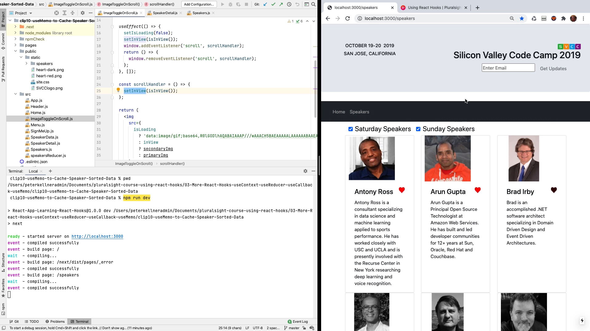

# Problem - Image Does Not Toggle Color When Show When Sat/Sun CheckBox Click

The problem is that the only thing toggles the image from changing from black and white to color is the scroll event.  What we want is when the user clicks the checkbox to show sat and/or sun speakers, the speakers in the view change, and the image control does not know that.

Here's the video:

<a href="https://youtu.be/IzbTWzjyzgg" target="_blank">https://youtu.be/IzbTWzjyzgg</a>

## Details to Skip Video

GitHub Solution:  
https://github.com/pkellner/pluralsight-course-using-react-hooks/tree/master/99-patches/03-More-React-Hooks-useContext-useReducer-useCallback-useMemo

Somehow, we need the `ImageToggleOnScroll` component to be aware of the change and re-calculate if it is in view.

My thinking is that we need to have some state change in this component that will trigger a re-render when the button is clicked.

So, how is this:

1.  Add a counter to the `Speakers` component that increments on every click of sat/sun checkbox.
2.  Pass that counter into `SpeakerDetail` and from there to our `ImageToggleOnScroll` component.
3.  Add that `clickCount` property as a dependency array passed to useEffet so that if the state of `clickCount` changes, the component re-renders.

OK,I've done that, made a rough video showing and explaining this, and added to source control as a patches folder so you can try it yourself.

Have a better idea?  Post to the discussions forum here with your idea.

http://disq.us/p/2dkdtqe

