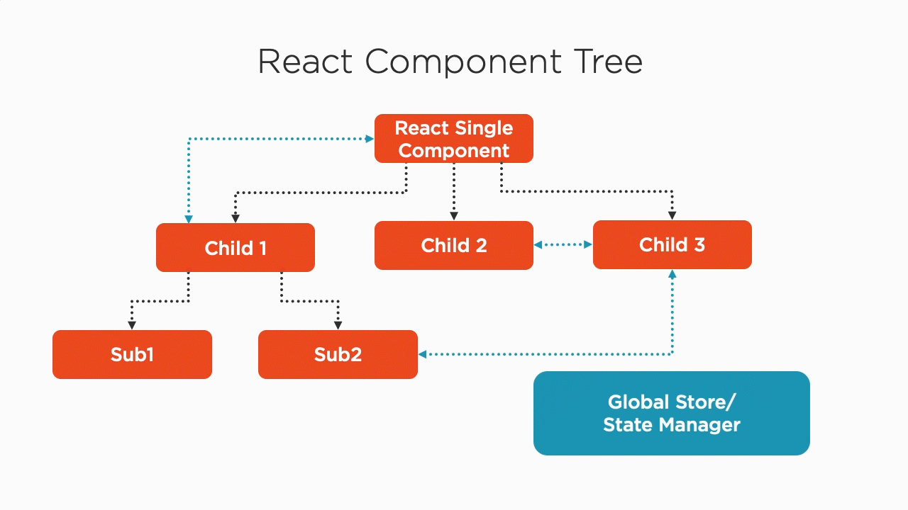

# August 2020 Update Notes "Using React Hooks"

## Completely NEW Module 6 - useContext + useReducer -> Redux Like App State

[Direct Link to Module 6](https://app.pluralsight.com/player?course=using-react-hooks&author=peter-kellner&name=95df19ab-9a51-4c3c-bb40-38358c179ee1&clip=0&mode=live)

One of the most powerful features that become available to you after learning 
how to use React Hooks, specifically the useContext and useReducer hooks, is that you
can combine the two to make a powerful "redux-like" solution for gobally sharing 
data between different parts of your application hierarchy.

I've literally added 30 minutes of 100% new content to the course that covers how to do this. 
I'd suggest you re-watch [Module 5](https://app.pluralsight.com/player?course=using-react-hooks&author=peter-kellner&name=5b710e27-32b2-4f8d-930b-b8ccd29a3ecc&clip=0&mode=live), building custom hooks first if you've not, then module 6, 
[Using useContext and useReducer to Make a Redux-like Global App State](https://app.pluralsight.com/player?course=using-react-hooks&author=peter-kellner&name=95df19ab-9a51-4c3c-bb40-38358c179ee1&clip=0&mode=live)

## Summary by Module of Updates

* Updated to Next.js version 9.5 
* Moved static files from `/static` to `/public/static` folder
* Updated eslint and prettier config files
* Removed next.config.js in favor of built in css importing
* Updated _app.js and removed _document.js to new Next.js standards
* Updated to React 16.13

## Module 2

Changed from 7 clips to 10 clips.  Significantly improved explanations and demos.  useEffect is not gone into much more in depth with better explanations.
The scrolling and colorizing component has been re-written to be much simpler and more instructive.

## Module 3

Same number of clips with same titles.  Much improved coding examples and enhanced explanations.

## Module 4

Same number of clips and very few changes.

## Module 5

Changed from 6 to 8 clips.  Completely re-worked REST example and custom hook to be written from the ground up with no cutting
and pasting. Same with the reducer code. This is much easier to follow and code along now.

## Module 6

This module is 100% new and replaces the previous module on authentication.  **Global App State With useContext and useReducer Like Redux**

# [(Back) Primary Rep Page](README.md)

